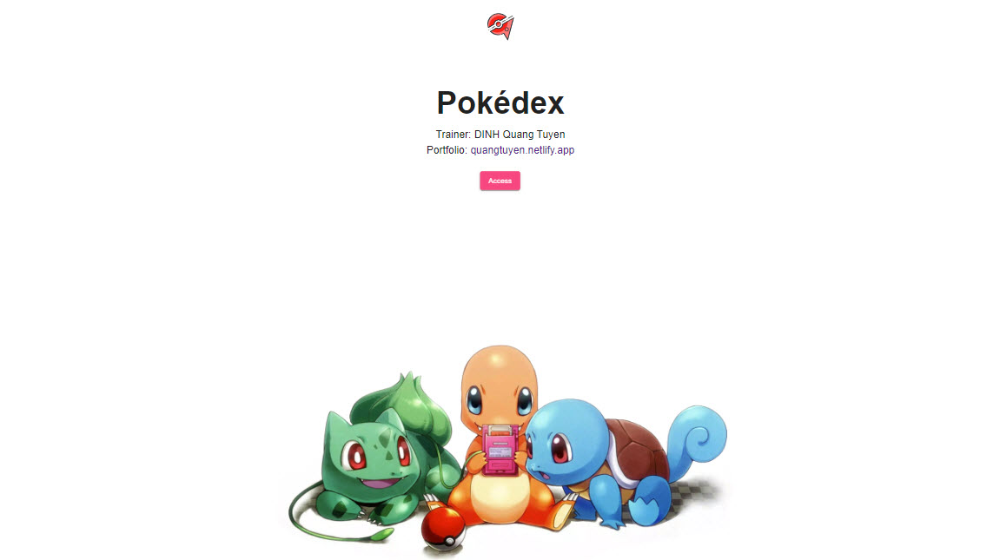
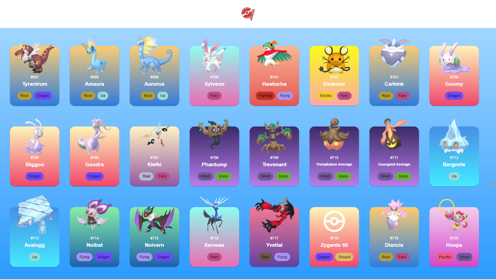
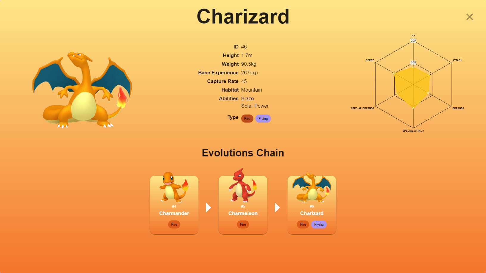

# Pokédex
For many years trainers around the world have worked together to collect data about Pokémon and created the [Pokéapi](https://pokeapi.co//). I'm a developer and I would like to help creating a Pokédex app, with the assistance of the Pokédex, people will find more useful informations about pokémons.





## Table of contents
* How to install and Run Pokédex
    * Clone Pokédex
    * Install necessary modules
    * Run Pokédex
* How to use Pokédex
    * Pokémon List
    * Dialog of details

## How to install and run Pokédex
### Clone and install
To clone and run this application, you'll need [Git](https://git-scm.com) and [Node.js](https://nodejs.org/en/download/) (which comes with [npm](http://npmjs.com)) installed on your computer. From your command line:

```bash
# Clone this repository
$ git clone https://github.com/Quang-Tuyen-DINH/pokedex-angular.git

# Go into the repository
$ cd pokedex-angular

# Install dependencies
$ npm install

# Run the app
$ ng serve
```

### Build
Run `ng build` to build the project. The build artifacts will be stored in the `dist/` directory.

### Running unit tests
Run `ng test` to execute the unit tests via [Karma](https://karma-runner.github.io).

### Running end-to-end tests
Run `ng e2e` to execute the end-to-end tests via a platform of your choice. To use this command, you need to first add a package that implements end-to-end testing capabilities.

## How to use Pokédex
### Landing Page
From Landing Page `http://localhost:4200/`, user cans access to Pokémon List `http://localhost:4200/list` by clicking the `Access` button
### Pokémon List
At the Pokémon List `http://localhost:4200/list`, user will find a list of pokémons collected by trainers around the world displayed in card, each card will show the minimum of informations about a pokémon such as its photo, name and type. By clicking a pokémon card, user can open a dialog of details of that pokémon

### Dialog of details
In the dialog of details, A clear photo of pokémon is shown on the left, its basic biography is displayed in the center with a radar chart about its stats on the right. Below is the evolution chain if pokémon evolves from time to time or its species data has been collected.

## Technologies used
* [Typescript](https://www.typescriptlang.org/)
* [Angular](https://angular.io/)
* [Rxjs](https://rxjs.dev/)
* [Angular Material](https://material.angular.io/)

## API
[Pokeapi](https://pokeapi.co/)
